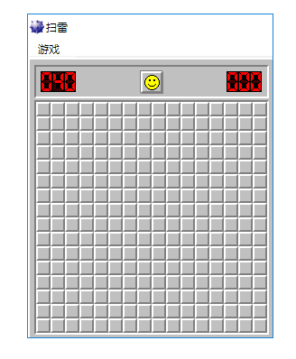
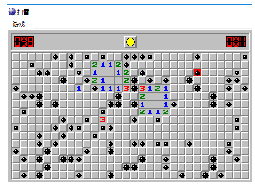
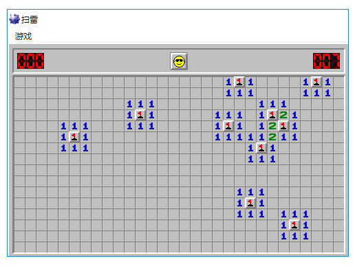
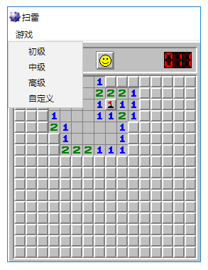

# 网页扫雷

用网页 1:1 还原 Windows 经典扫雷，纯 HTML / JavaScript，无需构建。

**在线试玩：https://wine.twgdh.com**

站点部署在 Cloudflare Pages，默认走 HTTPS。

## 截图

初级

游戏界面

难度菜单

## 玩法

- 左键翻开格子，右键插旗或标问号
- 点顶部「游戏」可切换初级 / 中级 / 高级，或自定义宽、高、雷数
- 点中间笑脸重新开始
- 页面会屏蔽浏览器默认右键菜单，方便插旗

| 难度 | 宽 × 高 | 雷数 |
| --- | --- | --- |
| 初级 | 9 × 9 | 10 |
| 中级 | 16 × 16 | 40 |
| 高级 | 30 × 16 | 99 |

默认进入中级。

## 本地运行

用浏览器直接打开 `src/index.html`，或在项目根目录起一个静态服务后访问 `/src/`。

主要文件：

- `src/index.html`：页面和菜单
- `src/Game.js`：关卡、布雷、计时、胜负
- `src/Item.js`：单个格子
- `src/Tally.js`：剩余雷数和用时
- `src/Layer.js`：图层定位
- `src/img/`：皮肤素材

## 许可

[Apache License 2.0](LICENSE)
